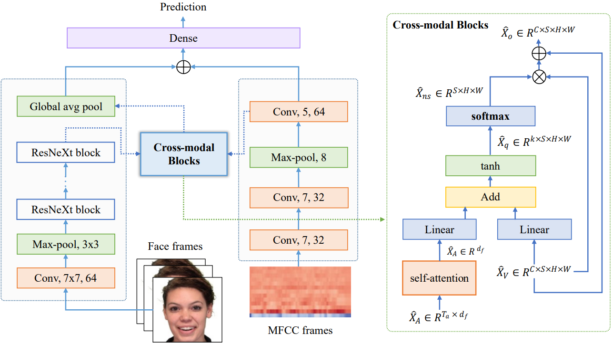

# CFN-SR
A CROSS-MODAL FUSION NETWORK BASED ON SELF-ATTENTION AND RESIDUAL STRUCTURE FOR MULTIMODAL EMOTION RECOGNITION

The audio-video based multimodal emotion recognition has attracted a lot of attention due to its robust performance. Most of the existing methods focus on proposing different cross-modal fusion strategies. However, these strategies introduce redundancy in the features of different modalities without fully considering the complementary properties between modal information, and these approaches do not guarantee the non-loss of original semantic information during intra- and inter-modal interactions. In this paper, we propose a novel cross-modal fusion network based on self-attention and residual structure (CFN-SR) for multimodal emotion recognition. Firstly, we perform representation learning for audio and video modalities to obtain the semantic features of the two modalities by efficient ResNeXt and 1D CNN, respectively. Secondly, we feed the features of the two modalities into the cross-modal blocks separately to ensure efficient complementarity and completeness of information through the self-attention mechanism and residual structure. Finally, we obtain the output of emotions by splicing the obtained fused representation with the original representation. To verify the effectiveness of the proposed method, we conduct experiments on the RAVDESS dataset. The experimental results show that the proposed CFN-SR achieves the state-of-the-art and obtains 75.76% accuracy with 26.30M parameters.



## Setup

Install dependencies

```bash
pip install opencv-python moviepy librosa sklearn
```

Download the RAVDESS dataset using the bash script

```bash
bash scripts/download_ravdess.sh <path/to/RAVDESS>
```

Or download the files manually

+ [All Video_Speech_Actors_##.zip files](https://zenodo.org/record/1188976)
+ [FacialTracking_Actors_01-24.zip](https://zenodo.org/record/3255102)

and follow the folder structure below and have .csv files in `landmarks/` (do not modify file names)

```bash
RAVDESS/
    landmarks/
        .csv landmark files
    Actor_01/
    ...
    Actor_24/
```

Preprocess the dataset using the following

```bash
python dataset_prep.py --datadir <path/to/RAVDESS>
```

Generated folder structure (do not modify file names)

```
RAVDESS/
    landmarks/
        .csv landmark files
    Actor_01/
    ...
    Actor_24/
    preprocessed/
        Actor_01/
        ...
        Actor_24/
            01-01-01-01-01-01-24.mp4/
                frames/
                    .jpg frames
                audios/
                    .wav raw audio
                    .npy MFCC features
            ...
```

Download checkpoints folder from [Google Drive](https://drive.google.com/drive/folders/14NqAECoZ58tlpkKtr8FiRtT7j_zOZCYN). The following script downloads all pretrained models (unimodal and MSAF) for all 6 folds.

```bash
bash scripts/download_checkpoints.sh
```

## Train

```bash
python main_msaf.py --datadir <path/to/RAVDESS/preprocessed> --checkpointdir checkpoints --train
```

All parameters

```bash
usage: main_msaf.py [-h] [--datadir DATADIR] [--k_fold K_FOLD] [--lr LR]
                    [--batch_size BATCH_SIZE] [--num_workers NUM_WORKERS]
                    [--epochs EPOCHS] [--checkpointdir CHECKPOINTDIR] [--no_verbose]
                    [--log_interval LOG_INTERVAL] [--no_save] [--train]
```

## Result

| Model          | Fusion Stage | Accuracy | #Params |
| -------------- | ------------ | -------- | ------- |
| Averaging      | Late         | 68.82    | 25.92M  |
| Multiplicative | Late         | 70.35    | 25.92M  |
| Multiplication | Late         | 70.56    | 25.92M  |
| Concat + FC    | Early        | 71.04    | 26.87M  |
| MCBP           | Early        | 71.32    | 51.03M  |
| MMTM           | Model        | 73.12    | 31.97M  |
| MSAF           | Model        | 74.86    | 25.94M  |
| ERANNs         | Model        | 74.80    |         |
| CFN-SR(Ours)   | Model        | 75.76    | 26.30M  |

## Reference

+ Note that some codes references [MSAF](https://github.com/anita-hu/MSAF/tree/master/ravdess)